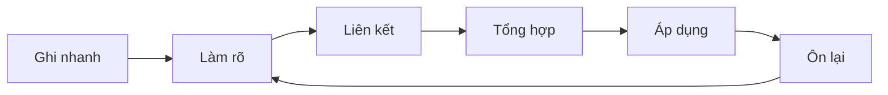

# 03 — Hệ thống nâng cao và làm đẹp

> [!abstract] Mục tiêu
> Sau bài này, bạn có thể biến Properties thành các bảng dữ liệu sống, dùng Graph và Canvas đúng mục đích, tạo dashboard, trình bày sơ đồ và tùy chỉnh giao diện có kiểm soát.

Bài này giả định bạn đã nắm [[01 - Obsidian nhập môn]] và [[02 - Xây dựng kho kiến thức]].

## 1. “Nâng cao” không có nghĩa là nhiều plugin

Một hệ thống tốt cần:

- **Ghi vào nhanh**: không phải chọn giữa quá nhiều folder và thuộc tính.
- **Tìm lại chắc chắn**: có nhiều đường tiếp cận cùng một note.
- **Dễ bảo trì**: ít quy tắc, tên property nhất quán.
- **Hỗ trợ hành động**: note giúp học, quyết định hoặc tạo ra sản phẩm.

> [!warning] Plugin chỉ giải quyết nhu cầu cụ thể
> Hãy dùng Core plugins trước. Chỉ cài Community plugin khi bạn đã mô tả được vấn đề lặp lại mà tính năng lõi chưa giải quyết. Kiểm tra độ tin cậy, quyền truy cập và lịch sử cập nhật; sao lưu vault trước thay đổi lớn.

## 2. Thiết kế schema Properties

Schema là bộ tên và quy ước property dùng xuyên vault. Một schema gọn cho người học:

| Property | Kiểu | Ví dụ | Dùng để |
| --- | --- | --- | --- |
| `type` | text | `concept`, `source`, `project` | Phân loại bản chất note |
| `status` | text | `inbox`, `active`, `reference`, `archive` | Theo dõi vòng đời |
| `created` | date | `2026-08-19` | Sắp xếp thời gian |
| `review` | date | `2026-08-26` | Lên lịch xem lại |
| `rating` | number | `4` | Đánh giá nguồn |
| `tags` | tags | `topic/design` | Lọc chủ đề xuyên thư mục |
| `related` | list | `"[[Typography]]"` | Quan hệ có cấu trúc |

Quy tắc bảo trì:

1. Dùng chữ thường và tên tiếng Anh ngắn nếu bạn muốn viết công thức dễ hơn.
2. Không dùng đồng thời `state` và `status` cho cùng một ý.
3. Không biến mọi thông tin thành property; nội dung diễn giải vẫn nằm trong thân note.
4. Chỉ dùng ngày dạng ISO `YYYY-MM-DD` để dễ sắp xếp và trao đổi.
5. Định kỳ mở **All properties view** để tìm property trùng hoặc sai chính tả.

## 3. Bases — database được tạo từ chính note Markdown

Bases là Core plugin tạo các view giống cơ sở dữ liệu từ file và Properties. Dữ liệu vẫn nằm trong các file `.md`; một base chỉ định cách lọc, sắp xếp và hiển thị chúng.

### Tạo bằng giao diện

1. Mở Command palette bằng `Ctrl+P`.
2. Chạy `Bases: Create new base` để tạo file `.base`, hoặc `Bases: Insert new base` để nhúng vào note hiện tại.
3. Thêm **Filter**, ví dụ tag là `learning/obsidian`.
4. Chọn Properties làm cột.
5. Tạo view Table, List hoặc Cards tùy dữ liệu.

### Base sống cho chính lộ trình này

Khối dưới đây không phải ảnh chụp; trong Obsidian nó là một view động. Khi property của ba bài thay đổi, bảng cũng thay đổi:

```base
filters:
  and:
    - file.hasTag("learning/obsidian")
    - file.ext == "md"
properties:
  level:
    displayName: "Mức độ"
  status:
    displayName: "Trạng thái"
  description:
    displayName: "Mô tả"
  file.mtime:
    displayName: "Sửa lần cuối"
views:
  - type: table
    name: "Lộ trình Obsidian"
    order:
      - file.name
      - level
      - status
      - description
      - file.mtime
```

Nếu phiên bản Obsidian của bạn không render khối `base`, hãy cập nhật ứng dụng và kiểm tra **Settings → Core plugins → Bases**.

### Chọn loại view

- **Table**: phù hợp project, sách, nguồn nghiên cứu và dữ liệu nhiều cột.
- **List**: phù hợp mục lục gọn hoặc danh sách note theo bộ lọc.
- **Cards**: phù hợp thư viện có ảnh bìa, portfolio, moodboard.
- **Map**: phù hợp note có dữ liệu vị trí.

> [!tip] Tạo bằng UI trước, sửa syntax sau
> Cú pháp `.base` là YAML và có thể viết tay, nhưng giao diện giúp tránh lỗi thụt lề. Chỉ sửa source khi bạn đã hiểu view do UI tạo ra.

## 4. Dashboard động

Một dashboard không nên sao chép mọi nội dung. Nó nên là điểm vào gồm link, embed và kết quả tìm kiếm sống.

Mẫu:

````markdown
# Dashboard

> [!quote] Trọng tâm
> Viết điều quan trọng nhất trong giai đoạn hiện tại.

## Điều hướng

- [[MOC — Thiết kế]]
- [[MOC — Học tập]]
- [[MOC — Dự án]]

## Task đang mở

```query
task-todo: -path:Templates
```

## Note đang học

```query
[status:active] tag:#status/learning
```

## Gần đây

- [[Daily note hôm nay]]
````

Ghim dashboard bằng **Bookmarks** để mở nhanh. Khi dashboard dài hơn một màn hình, hãy tách bớt thành MOC chuyên biệt.

## 5. Graph view — dùng để chẩn đoán mạng lưới

Graph view toàn cục hiển thị toàn bộ note và liên kết. Local Graph chỉ hiển thị các note quanh note hiện tại.

Graph hữu ích để:

- Tìm **orphan notes**: note không có liên kết.
- Phát hiện cụm chủ đề đang hình thành.
- Nhìn note trung tâm có nhiều backlinks.
- Kiểm tra một note có liên kết lệch sang chủ đề không liên quan.

Graph không nên dùng để:

- Đánh giá chất lượng kiến thức chỉ bằng số đường nối.
- Thêm liên kết vô nghĩa để hình “đẹp hơn”.
- Thay thế MOC, vì Graph không diễn giải thứ tự đọc.

### Bộ lọc gợi ý

Trong Graph settings, thử:

```text
-path:Templates -path:.obsidian
```

Tạo Groups theo truy vấn, ví dụ:

```text
tag:#topic/design
tag:#source/book
[status:active]
```

Với Local Graph, depth `1` thường dễ đọc nhất; tăng lên `2` khi muốn khám phá hàng xóm của các note liên quan.

## 6. Canvas — tư duy không gian

Canvas cung cấp mặt phẳng vô hạn để đặt note, ảnh, PDF, web page và nối chúng bằng đường có nhãn.

Ba tình huống Canvas đặc biệt hiệu quả:

1. **Lập kế hoạch dự án**: mục tiêu → nghiên cứu → quyết định → đầu ra.
2. **So sánh lựa chọn**: mỗi cột là một phương án, mỗi hàng là tiêu chí.
3. **Hiểu hệ thống**: đặt các thành phần và vẽ quan hệ nhân quả.

Quy trình gợi ý:

1. Double-click vùng trống để ghi card nháp.
2. Kéo note thật từ File explorer vào Canvas.
3. Nối card và đặt nhãn như `dẫn đến`, `phản biện`, `ví dụ của`.
4. Gom nhóm theo giai đoạn hoặc chủ đề.
5. Chuyển text card quan trọng thành file để nó có Backlinks và tồn tại độc lập.

> [!info] Text card và note card khác nhau
> Text card chỉ sống trong Canvas và không xuất hiện trong Backlinks. Kiến thức cần tìm lại lâu dài nên được chuyển thành file Markdown.

Bạn có thể nhúng Canvas vào note:

```markdown
![[Tên canvas.canvas]]
```

## 7. Trình bày dữ liệu nâng cao

### Bảng

```markdown
| Tiêu chí | Lựa chọn A | Lựa chọn B |
| --- | :---: | ---: |
| Chi phí | Thấp | Cao |
| Tốc độ | Nhanh | Chậm |
```

Dấu `:` điều khiển căn trái, giữa hoặc phải. Bảng phù hợp dữ liệu ngắn; nội dung dài nên dùng tiêu đề và danh sách.

### Footnote

```markdown
Một nhận định cần nguồn tham khảo.[^nguon]

[^nguon]: Tên tác giả, tên tài liệu, năm, URL.
```

### Công thức toán

Inline:

```markdown
Năng lượng được mô tả bởi $E = mc^2$.
```

Khối công thức:

```markdown
$$
\frac{a+b}{c} = d
$$
```

### Mermaid — sơ đồ bằng văn bản

````markdown

````

Kết quả của quy trình trên:


Mermaid phù hợp flowchart, timeline, sequence diagram và sơ đồ quan hệ. Vì nguồn là văn bản, bạn dễ sửa và quản lý phiên bản.

### HTML khi Markdown chưa đủ

Obsidian hỗ trợ một phần HTML trong note:

```html
<details>
  <summary>Bấm để xem đáp án</summary>
  Nội dung được ẩn cho tới khi mở.
</details>

<kbd>Ctrl</kbd> + <kbd>P</kbd>
```

Ưu tiên Markdown/Callout trước HTML để note dễ đọc ở ứng dụng khác.

## 8. Một hệ thống thẩm mỹ bền vững

Thứ tự nên làm:

1. Chọn **Light/Dark mode** phù hợp mắt và môi trường.
2. Chọn font dễ đọc, line width vừa phải và cỡ chữ thoải mái trong **Appearance**.
3. Chọn một Community theme nếu thật sự cần.
4. Dùng CSS snippets cho vài thay đổi nhỏ mà theme không có.
5. Dùng `cssclasses` để chỉ áp dụng kiểu đặc biệt cho một nhóm note.

### Nguyên tắc trình bày

- Mỗi note chỉ có một `# H1`.
- Tiêu đề không nhảy cấp từ H2 sang H4.
- Đoạn văn ngắn, một đoạn một ý.
- Mỗi màn hình chỉ có một điểm nhấn chính.
- Dùng callout theo chức năng ổn định: `tip` cho mẹo, `warning` cho rủi ro, `abstract` cho tóm tắt.
- Ảnh nên có cùng kiểu bo góc và độ rộng hợp lý.
- Emoji dùng như biển chỉ dẫn, không dùng như đồ trang trí khắp nơi.

## 9. CSS snippets — tùy chỉnh có phạm vi

### Cách cài snippet

1. Vào **Settings → Appearance → CSS snippets**.
2. Chọn **Open snippets folder**.
3. Tạo file `pretty-notes.css` trong folder đó.
4. Dán CSS bên dưới và lưu.
5. Chọn **Reload snippets**, rồi bật `pretty-notes`.

### Snippet nhẹ và ít phụ thuộc theme

```css
/* Áp dụng cho note có property: cssclasses: [pretty-note] */
.pretty-note {
  --file-line-width: 820px;
  --h1-color: var(--color-accent);
  --h2-color: var(--color-accent-2);
  --callout-radius: 12px;
}

.pretty-note img {
  border-radius: 12px;
  box-shadow: 0 6px 20px rgb(0 0 0 / 12%);
}

.pretty-note .callout {
  border-width: 1px;
  box-shadow: 0 4px 14px rgb(0 0 0 / 8%);
}

.pretty-note hr {
  margin-block: 2.5rem;
}
```

Trong note muốn áp dụng, thêm property:

```yaml
---
cssclasses:
  - pretty-note
---
```

Chính note bạn đang đọc đã có class này. Sau khi bật snippet, bạn có thể nhìn ngay sự khác biệt.

> [!warning] CSS có thể cần bảo trì
> Tên biến CSS chính thức thường bền hơn selector sâu vào cấu trúc giao diện. Sau khi đổi theme hoặc cập nhật lớn, hãy kiểm tra cả Live Preview và Reading view. Nếu giao diện lỗi, tắt snippet để khoanh vùng nguyên nhân.

## 10. Thiết kế note “đẹp mà hữu dụng”

Mẫu note nguồn hoàn chỉnh:

```markdown
---
title: "Tên tài liệu"
aliases: []
tags:
  - source/article
  - topic/design
type: source
status: reference
author: "Tên tác giả"
created: 2026-08-19
rating: 4
cssclasses:
  - pretty-note
---

# Tên tài liệu

> [!abstract] Tóm tắt
> Nội dung cốt lõi bằng 3–5 câu do chính mình viết.

## Vì sao nguồn này quan trọng?

## Luận điểm chính

### 1. Tên luận điểm

- **Tác giả nói:**
- **Tôi hiểu:**
- **Tôi đồng ý/không đồng ý vì:**
- **Ứng dụng:**

> [!quote] Trích dẫn ngắn
> Ghi đúng câu cần giữ lại và số trang.

## Câu hỏi mở

- [ ] 

## Kết nối

- Bổ sung cho [[...]] vì...
- Mâu thuẫn với [[...]] ở điểm...
- Có thể áp dụng trong [[...]] bằng cách...

## Nguồn

- [Liên kết gốc](https://example.com)
```

Điểm quan trọng nhất là ba dòng **Tôi hiểu**, **Tôi đánh giá** và **Ứng dụng**. Chúng biến việc lưu trữ thành tư duy.

## 11. Chu kỳ bảo trì vault

### Mỗi ngày — 5 phút

- Ghi ý mới vào Daily note.
- Liên kết note mới với ít nhất một bối cảnh.
- Hoàn thành hoặc chuyển task chưa xong.

### Mỗi tuần — 20 phút

- Xử lý note có `status: inbox`.
- Kiểm tra task chưa hoàn thành bằng Search.
- Mở Local Graph của MOC đang học.
- Tách các ý lớn khỏi Daily note thành note riêng.

### Mỗi tháng — 30 phút

- Kiểm tra All properties view để chuẩn hóa property.
- Gộp tag trùng nghĩa.
- Cập nhật MOC thay vì tái cấu trúc toàn bộ folder.
- Sao lưu và thử mở một file từ bản sao.
- Gỡ plugin hoặc snippet không còn tạo giá trị.

## 12. Những bẫy thường gặp

| Bẫy | Dấu hiệu | Cách sửa |
| --- | --- | --- |
| Sưu tầm thay vì học | Nhiều clipping, ít tóm tắt | Viết lại bằng lời mình và thêm ứng dụng |
| Quá nhiều tag | Không nhớ nên chọn tag nào | Giữ tag cho status, source, topic lớn |
| Note quá dài | Khó link tới một ý cụ thể | Tách note theo khái niệm, dùng MOC |
| Quá nhiều plugin | Vault chậm, workflow dễ vỡ | Tắt từng plugin, giữ bộ tối thiểu |
| Làm đẹp trước cấu trúc | Note nhiều màu nhưng khó quét | Sửa heading, khoảng trắng và bố cục trước |
| Graph đẹp nhưng link rỗng | Nhiều đường nối không có diễn giải | Viết câu mô tả quan hệ quanh mỗi link |
| Không có backup | Chỉ dựa vào một thiết bị/sync | Sao lưu độc lập và kiểm tra khôi phục |

## Bài thực hành cuối lộ trình

- [ ] Chuẩn hóa Properties của ít nhất năm note.
- [ ] Tạo một Base dạng Table cho danh sách học tập.
- [ ] Tạo một dashboard có truy vấn task động.
- [ ] Mở Local Graph và xử lý một orphan note.
- [ ] Tạo một Canvas cho dự án hoặc chủ đề đang học.
- [ ] Vẽ một sơ đồ Mermaid trong note.
- [ ] Tạo và bật `pretty-notes.css`, sau đó áp dụng bằng `cssclasses`.
- [ ] Viết lịch bảo trì vault phù hợp với bạn.

> [!success] Dấu hiệu hệ thống đang hoạt động
> Bạn ghi nhanh mà không phải suy nghĩ nhiều về nơi lưu, tìm lại được cùng một note bằng nhiều cách, và các note cũ thường xuyên xuất hiện đúng lúc trong công việc mới.

## Tiếp tục học thế nào?

Trong 30 ngày tới, chỉ dùng những tính năng trong ba bài này. Ghi lại mọi thao tác lặp hoặc điểm gây khó chịu. Chỉ sau đó mới cân nhắc plugin cộng đồng cho đúng vấn đề thực tế của bạn.

## Tài liệu chính thức

- [Introduction to Bases — Obsidian Help](https://obsidian.md/help/bases)
- [Create a base — Obsidian Help](https://obsidian.md/help/bases/create-base)
- [Bases syntax — Obsidian Help](https://obsidian.md/help/bases/syntax)
- [Graph view — Obsidian Help](https://obsidian.md/help/Plugins/Graph%2Bview)
- [Canvas — Obsidian Help](https://obsidian.md/help/Plugins/Canvas)
- [CSS snippets — Obsidian Help](https://obsidian.md/help/Extending%2BObsidian/CSS%2Bsnippets)

